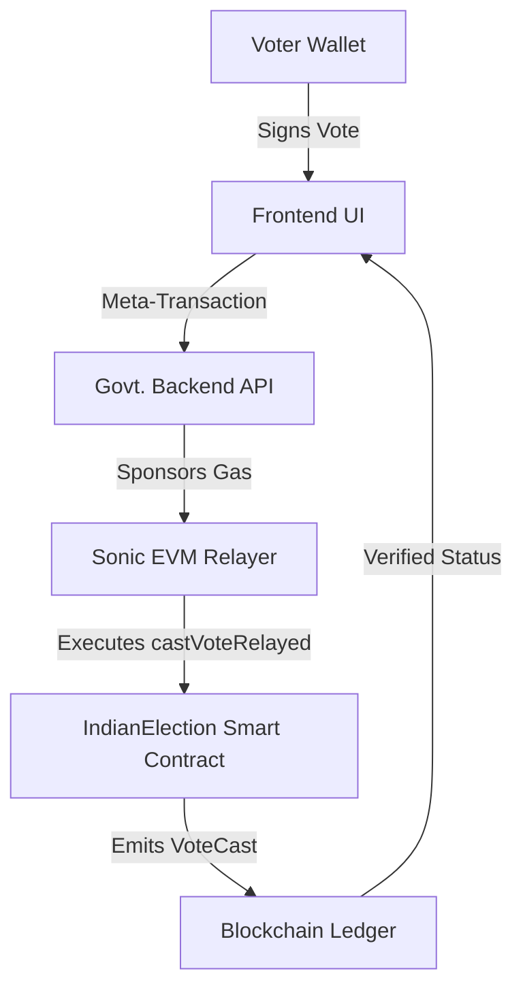

# Bharat Chain Vote: Architecture & System Design

This document provides a technical deep-dive into the architectural decisions that enable a secure, scalable, and zero-cost blockchain voting system for India.

## 1. System Overview

The architecture follows a "Proxy-Relayer" model. Instead of voters interacting directly with the blockchain (which requires gas fees), they interact via a digital signature that is relayed by a government-funded infrastructure.

## 2. Component Breakdown

### A. Frontend (Voter Interface)
- **Role:** Handles identity commitment and transaction signing.
- **Privacy:** Implements Sha256/Keccak256 hashing for Aadhaar and EPIC numbers *before* sending any data to the network.
- **Signing:** Uses EIP-712 to prompt the user to sign a structured data object. This action is purely cryptographic and occurs locally on the user's device.

### B. Backend (Government Relayer)
- **Role:** The bridge between the citizen and the blockchain.
- **Transaction Paymaster:** The backend holds a funded wallet (S tokens) and pays the gas fees for every valid signature it receives.
- **DDoS Prevention:** Implements rate limiting and validates that the incoming signature matches a registered voter *before* submitting to the chain.

### C. Smart Contract (The Source of Truth)
- **State Machine:** Governs the election phases (Registration, Voting, Counting, Results).
- **Internal Logic:**
    - `registerVoter()`: Maps identity hashes to Ethereum addresses.
    - `castVoteRelayed()`: Recovers the signer's address from the provided signature. If it matches a registered voter who hasn't voted yet, the vote is recorded.
- **VVPAT Generation:** Automatically generates a cryptographic receipt for every transaction.

## 3. The "Zero-Cost" Logic

In a standard Ethereum/EVM transaction, the `msg.sender` pays the gas. In our **Gasless Model**, we decouple the *Signer* from the *Sender*.

1. **The Signer (Voter):** Signs a hash of `(voterAddress, candidateId, nonce, contractAddress)`.
2. **The Sender (Relayer):** Calls the smart contract and passes the Voter's `(voterAddress, candidateId, v, r, s)` signature components.
3. **The Contract:** Uses `ecrecover` to extract the Voter's address and updates the state. The Relayer address pays the gas, but the Voter's address is the one recorded as having voted.

## 4. Security & Compliance

### Double-Vote Prevention
The smart contract checks `voters[voterAddress].hasVoted` before every execution. Even if an attacker re-submits the same signature (Replay Attack), the contract will reject it because the `hasVoted` flag is already set to `true`.

### Data Sovereignty
By using Sonic EVM, all election data remains on a public, permissionless ledger. This means that while the government *facilitates* the voting (paying gas), it cannot *manipulate* the data, as the rules are enforced by the immutable code of the smart contract.

### ECI Compliance Checklist
- [x] **NOTA Support:** Built-in candidate.
- [x] **VVPAT:** On-chain receipts.
- [x] **Constituency Locks:** Geographic voting enforcement.
- [x] **Zero-Cost:** State-sponsored gas fees.
